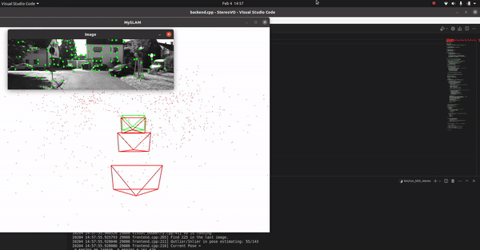

# Stereo Visual Odometry using Kitti Dataset

## Running the code
### Build the file using
```
cd ~/ws
mkdir build
cd build
cmake ..
make
```
### Then to run on KITTI dataset

```
cd ~/ws
bin/run_kitti_stereo
```

## Results

### Output will be like

```
0204 14:58:25.402386 29886 visual_odometry.cpp:41] VO is running
I0204 14:58:25.413861 29886 frontend.cpp:265] Find 130 in the last image.
I0204 14:58:25.415143 29886 frontend.cpp:211] Outlier/Inlier in pose estimating: 16/88
I0204 14:58:25.415163 29886 frontend.cpp:216] Current Pose = 
000.559344 0-0.798614 000.222148 00-25.5681
000.825838 000.560017 0-0.066126 00-302.885
-0.0715975 000.220446 000.972768 00-356.362
0000000000 0000000000 0000000000 0000000001
I0204 14:58:25.420295 29886 visual_odometry.cpp:62] VO cost time: 0.00845767 seconds.
```

### Output GIF of the visual odometry


## Things to take care of
1. Use 3rd party libraries for version compatibility
2. May need to run commands (or add in .bashrc):
```
export LD_LIBRARY_PATH=$LD_LIBRARY_PATH:/usr/local/lib
export LD_PRELOAD=/usr/lib/x86_64-linux-gnu/libffi.so.7
```
